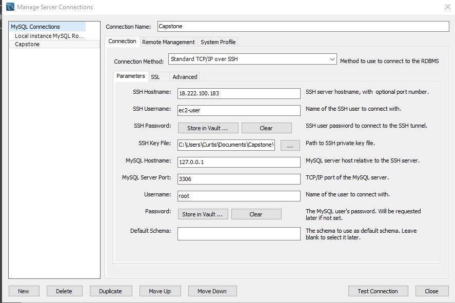

# Connection setup:

Use the .pem key

Note: There is a known bug with MySQL workbench and the database where you need to first save your connection under manage connections -> new. Then you can open it up with the grey button on the home screen.
